# Pawstagram
### Live Version of App: [Pawstagram](https://bcbc-pawstagram.herokuapp.com/)
### 1. Why / Background
  * This is Berkeley Coding Boot Camp (BCBC) project 2 group 6.
    * The BCBC curriculum generally focuses on JavaScript along with HTML/CSS, using the MERN (MongoDB, Express, React, Node) software stack to teach web development skills across the client and server. 
  * Pawstagram is a full-stack social media web based application that enable users to show off photos of their pets, comment on each other’s pets and join communities with other like minded individuals to chat with and meet up with. Communities can be anything from "San Francisco Dog Joggers" to "Cats wearing Hats" and are user-created.
 ### 2. What / Objectives / User Stories
  * From design through deployment of the application, this project used the following web development technologies:
    * Server-side: Node.js w/ Express web app framework; MySQL & Firebase DBs for data persistence w/ Sequelize ORM; Passport for user authentication
    * Client-side: Handlebars.js templating system for views; Material Bootstrap framework for HTML/CSS
  * User Stories, by categorization:
    * Design and develop Wireframe mockup including conceptual page types: login, user profile, pet profile, community
    * Design and develop Model schema including ORM (Sequelize) and DB (MySQL, Firebase) configuration
    * Design and develop View on UI including layouts and templates (Handlebars)
    * Design and develop Controller functions including routing and required CRUD operations
    * DB Tables PLACEHOLDER: split across team, 1-2 tables each (Users, Pets, Communities, etc) 
    * The JavaScript Glue PLACEHOLDER: split across team, and organize into actual user stories
 ### 3. How / Design Description
  * The scope of the project fits well into [Agile methodology with Scrum and Kanban frameworks](https://en.wikipedia.org/wiki/Agile_software_development). Due to sufficient scope and group project, GitHub's built-in tools were used to support project execution:
    * [Projects](https://github.com/sgenini/projectTwo/projects/1): Kanban board for documenting user stories and overall progress
    * [Issues](https://github.com/sgenini/projectTwo/issues): Issue tracking for user stories, features and bug report
  * Functionality - refer to [video of application user flow](https://drive.google.com/open?id=1-7NwQiifKQjHtdcAljDwRRVcP_7MdPFq):
    * Wireframe
      * Home page 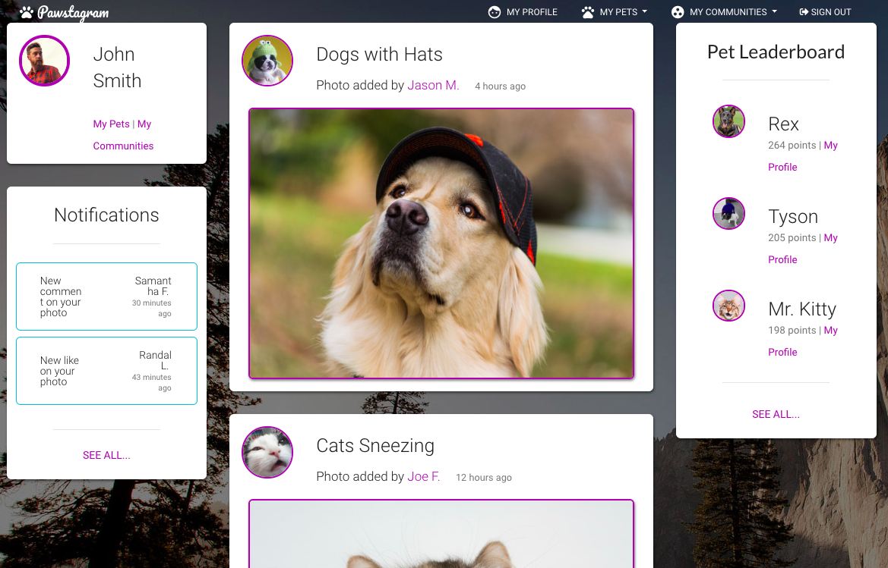
      * Sign up as a new user... 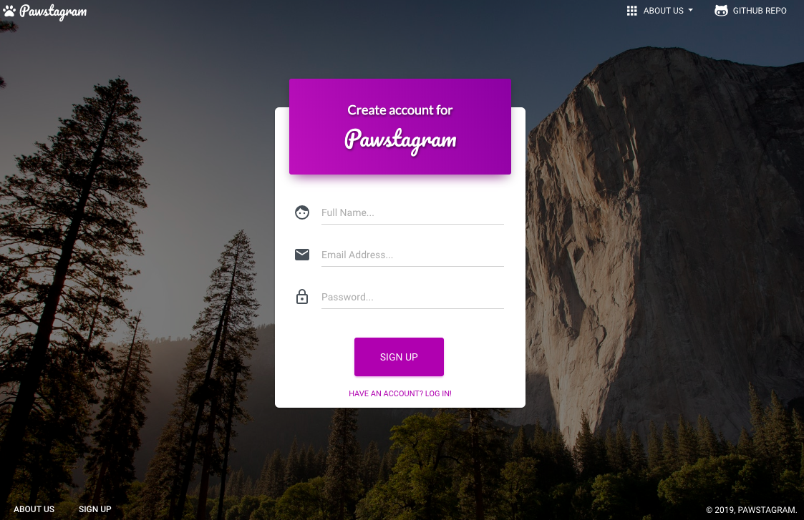
      * Login with email and password to authenticate... 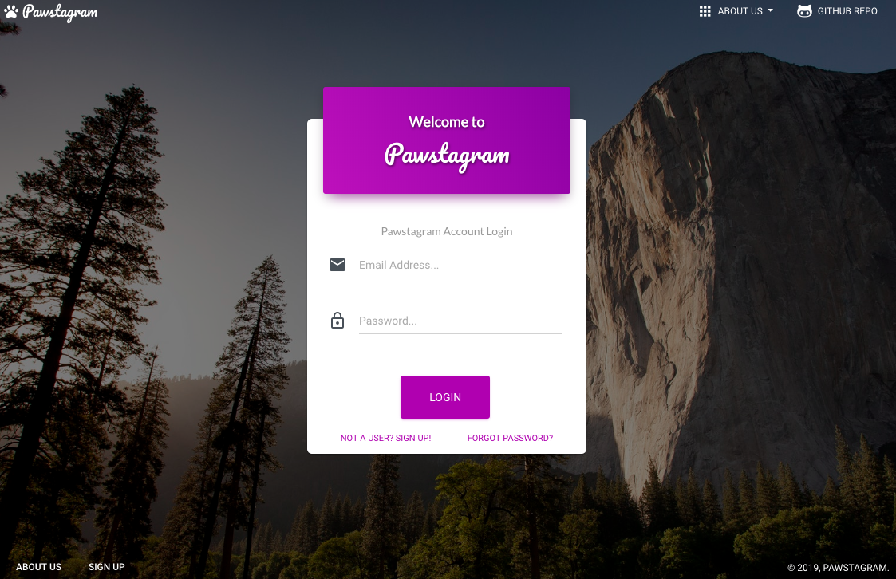
      * View authenticated user profile... 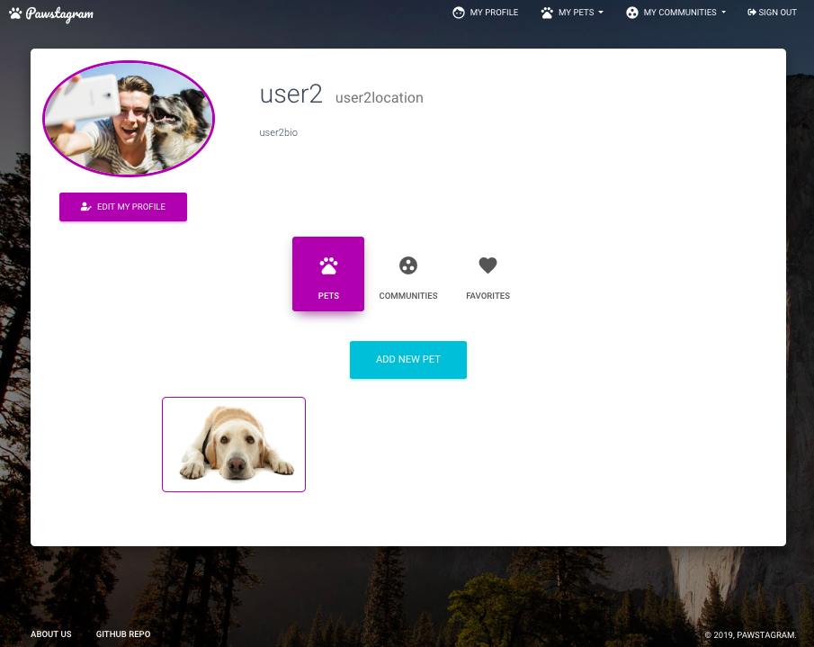
      * View pet profile... 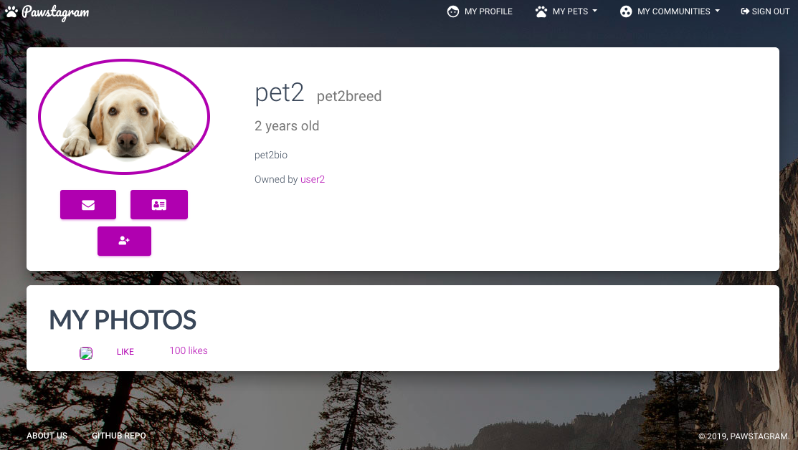
      * Add new pet to authenticated user... 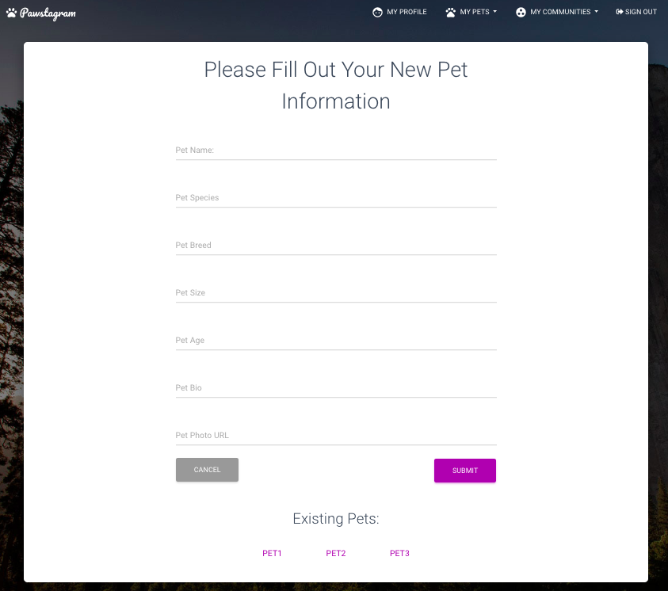
      * View other user profiles... 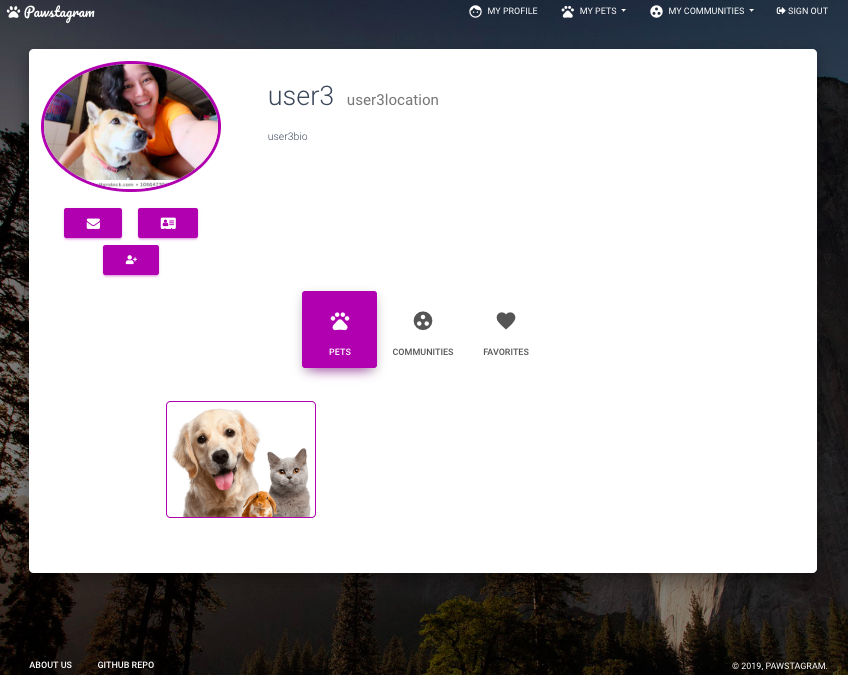
      * View community posts by members... 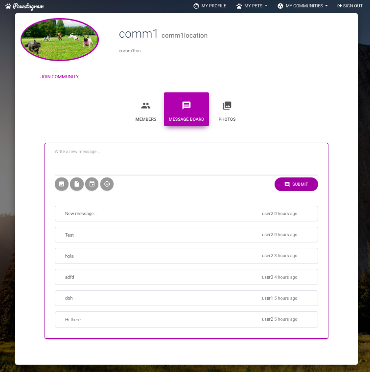
      * Add new community... 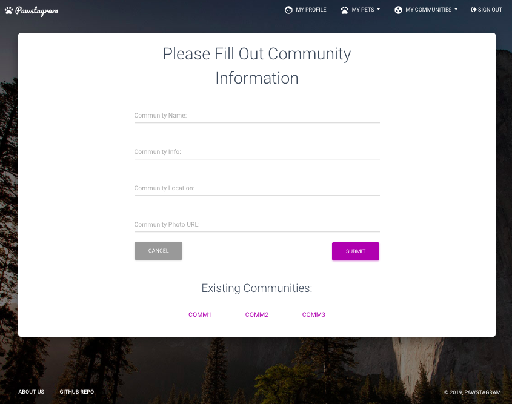
      * JSON Resources
        * Communities 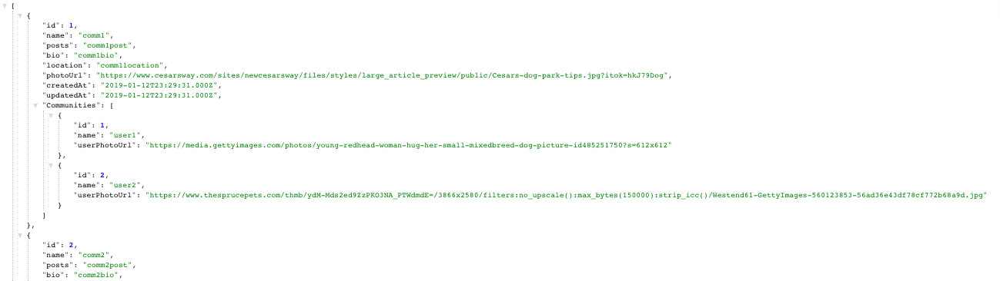
        * Users 
        * Pets 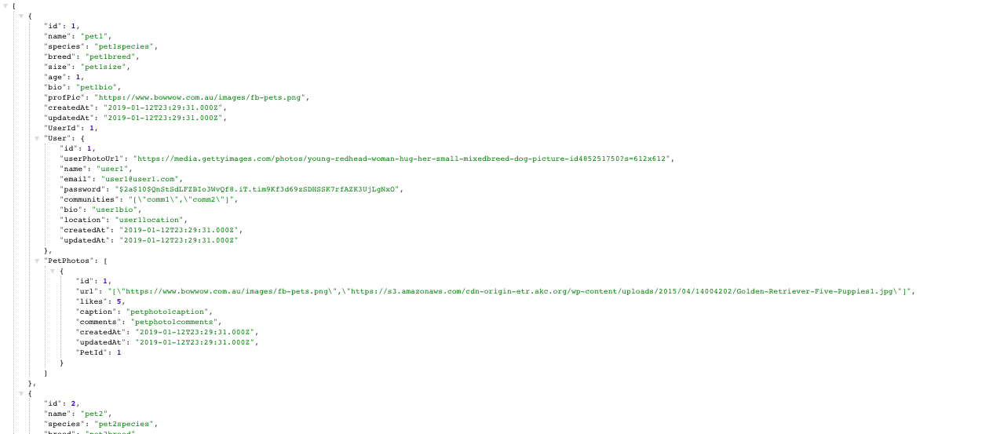
  * Design Description 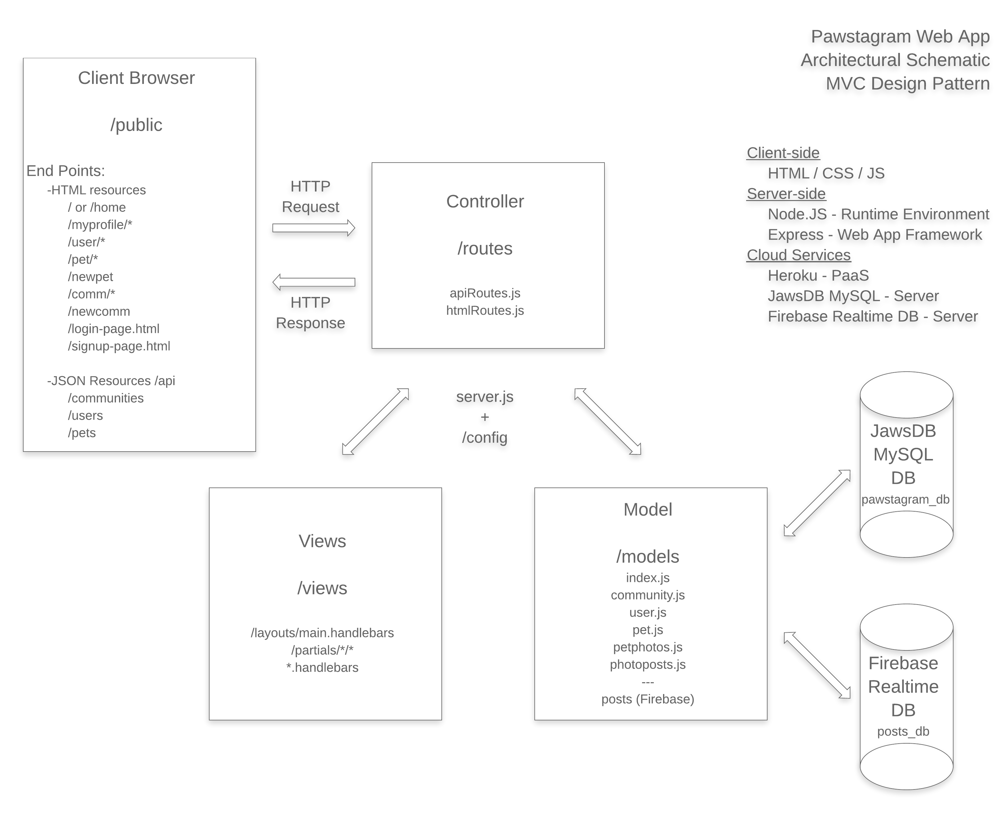
    * Application Setup (server.js)
      * Configure Express web app framework listening on process.env.PORT (Heroku) or default to 3000. Parse URL encoded, any type including nested objects, and JSON and call appropriate routing.
      * Required modules: npm (dotenv, express, express-handlebars), path
      * Relevant functions: require(), use(), engine(), set(), sync(), listen()
      * Export: app
    * Database Setup (schema.sql, seeds.sql TBD)
      * Create pawstagram_db database
      * Available Seed with TBD
    * Configuration Definition (config.json)
      * Define configuration object with nested development, test and production environments
    * Model Setup (/models, index.js) 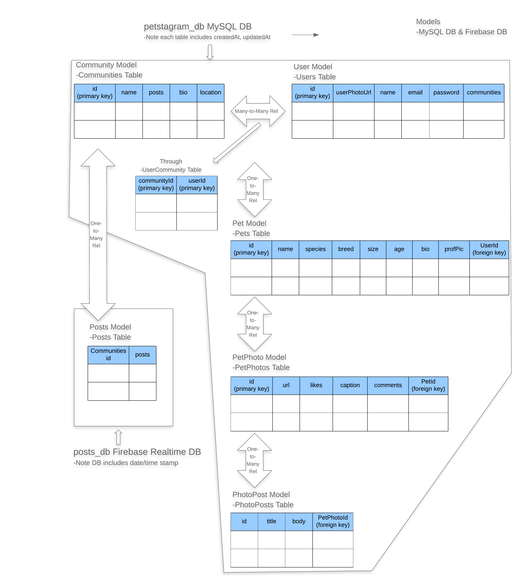
      * Define Sequelize version of Community, User, Pet, PetPhoto, PhotoPost objects including associations
      * TBD Configure connection to MySQL configuration
      * TBD Include connection conditional to enable MySQL with Heroku deployment using JawsDB add-on
      * Required modules: fs, path, sequelize, config.json
      * Relevant functions: require(), readdirSync(), filter(), forEach(), import(), join(), keys(), associate(), exports(), define(), belongsToMany(), hasMany(), belongsTo()
      * Export: db, Community, Pet, PetPhoto, PhotoPost, User
    * Posts Model Setup (TBD)
      * Define Firebase Realtime version of Posts object
    * Controller Setup (apiRoutes.js, htmlRoutes.js)
      * Assign routing views <-> model <-> DB as HTTP methods <-> CRUD operations <-> SQL
        * POST <-> Create <-> INSERT
        * GET <-> Read <-> SELECT
        * PUT <-> Update <-> UPDATE
        * DELETE <-> Delete <-> DELETE
      * Required modules: /models, path
      * Relevant functions: require(), exports(), get(), findAll(), findOne(), post(), create(), put(), update(), delete(), destroy(), sendFile(), render()
      * Export: router, function(app) {}
    * Authentication Setup
      * Use Passport to configure authentication...
      * Required modules: TBD
      * Relevant functions: TBD
      * Export: TBD
    * View Setup (server-side: /layout/main.handlebars, /layout/partials/*.handlebars, *.handlebars, client-side: home-page, login-page, signup-page)
      * Render statically HTML pages on the client-side within /public.
      * Use Handlebars.js as web templating system with HTML pages leveraging main.handlebars layout and various *.handlebars partials.  
  * Prerequisites for Development:
    * MacBook Air (Intel Core i7, 2.2 GHz, 1 Processor, 2 Cores, 8GB)
    * 64 bit operating system 
    * git version 2.18.0
    * Visual Studio Code Version 1.29.1
    * [GitHub projectTwo](https://github.com/sgenini/projectTwo)
    * Chrome Version 70.0.3538.110 (Official Build) (64-bit)
  * Built With:
    * Client-side:
      * HTML/CSS/JS
      * [Material Design for Bootstrap](https://fezvrasta.github.io/bootstrap-material-design/docs/4.0/getting-started/introduction/)
    * Server-side:
      * [Node.js](https://nodejs.org/docs/latest/api/documentation.html)
        * [npm](https://www.npmjs.com/)
          * [dotenv](https://www.npmjs.com/package/dotenv)
          * [express](https://www.npmjs.com/package/express)
          * [express-handlebars](https://www.npmjs.com/package/express-handlebars)
          * [mysql2](https://www.npmjs.com/package/mysql2)
          * [sequelize](https://www.npmjs.com/package/sequelize)
          * [passport](https://www.npmjs.com/package/passport)
    * Cloud:
      * [Heroku](https://devcenter.heroku.com/articles/getting-started-with-nodejs) with [JawsDB MySQL plugin](https://devcenter.heroku.com/articles/jawsdb)
      * [Firebase Realtime DB](https://firebase.google.com/docs/web/setup)
  * Installing:
    * For further development or use of this application, clone or download application files from GitHub, which is organized into the following directory structure:
      * /projectTwo (application root directory level)
        * /config
          * /middleware
        * /models
        * /node_modules (ignored by git) - generated first time npm install executes
        * /public
          * assets
            * /css
            * /demo
            * /img (various)
              * /examples (various)
              * /faces (various)
            * /js
              * /core (various)
              * /plugins (various)
            * /readme_links/ (various)
            * /scss (various)
        * /routes
        * /test
        * /views
          * /layouts
          * /partials
            * /footer
            * /nav
            * /petPhotos
            * /pets
            * /userCommunities
        * .eslintignore
        * .eslintrc.json
        * .gitignore
        * .travis.yml
        * LICENSE
        * package-lock.json
        * package.json - includes scripts, dependencies, devDependencies
        * README.md
        * server.js
    * Once the application files are ready per the above structure, go to the application root directory level
      * Enter the following in terminal to install required node packages. This executes by referring to the included dependencies in package.json and creates required node packages in /node_modules and package-lock.json:
        * npm install
  * Running the tests:
    * For linter rules, refer to [eslintrc.json](.eslintrc.json)
    * Unit testing was informally executed
    * Continuous Integration was practiced by merging smaller code changes frequently and, prior to deployment, leveraging [Travis CI](https://docs.travis-ci.com/user/tutorial/) to carry out a series of automated tasks to build and test the code
  * Deployment:
    * App deployed on [Heroku](https://bcbc-pawstagram.herokuapp.com/)
 ## Versioning
  * For the versions available, see the tags on this repository.
 ## Authors
  * Nick Morales, Orion Abrams, Stéphane Genini, John Kawahara.
  * N/A- See also the list of contributors who participated in this project.
 ## License
  * This project is licensed under the [MIT License](LICENSE).
 ## Acknowledgments
  * Thanks to BCBC program personnel, especially our instructor, David Hallinan, along with our TAs, Hannah Bowers and Glo Austin, for their guidance and support.
